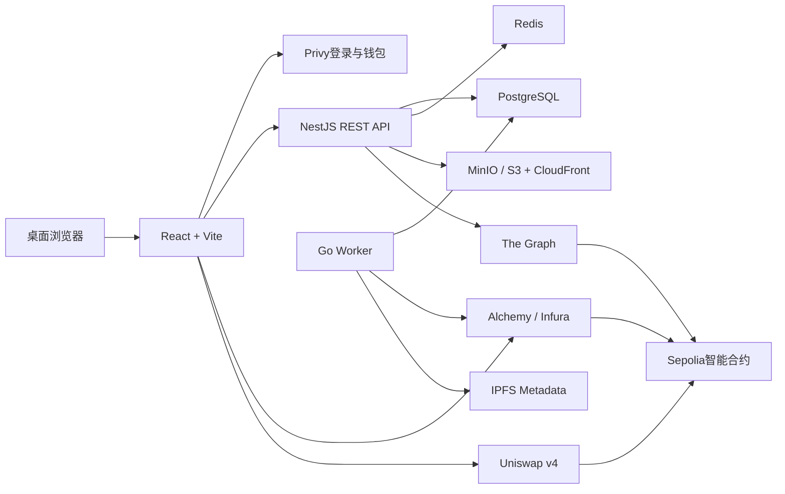

结论：需求确定性已达到约95%，整体没有跑偏，可以进入开发准备阶段。剩余不确定项主要是部署时的账号、密钥、测试币数量和ETH/YD初始价格，不影响代码架构。

需求基线来自课程原文：:codex-file-citation{path="/Users/jgt/JGTCode/京城一灯36期/豆包直播录音会议记录/web3相关/5原文智能合约设计4_Web3职业发展与DeFi技术实践分享.pdf" purpose="source"}

## 一、最终目标

用户可以完成：

```text
Privy登录
→ 使用Test USDT或SepoliaETH兑换YD
→ approve YD
→ 购买课程
→ 观看全部必修视频
→ 课程进度达到100%
→ Go Worker自动铸造不可转让证书
```

教师可以申请身份、创建课程、上传视频、申请发布和改价；管理员负责审核、上下架和紧急暂停。

## 二、总体架构



核心原则：

- 链上是课程销售状态、购买权益和证书的最终事实。
- PostgreSQL保存用户、视频、评论、进度和工作流。
- 前端、The Graph、消息队列都不能自行决定购买或铸证。
- 测试资产均无真实价值。

## 三、智能合约

自研五个不可升级合约：

1. `YDToken`
   - ERC20，一登币，符号YD，18位精度。
   - 固定发行1,000,000 YD到Treasury。
   - 部署后不能增发。

2. `CourseCatalog`
   - 链上课程ID、教师收款钱包、YD价格、发布状态和metadata hash。
   - 教师提交申请，管理员审核后发布。
   - 改价和更换收款地址均需管理员审批。

3. `CourseMarket`
   - `approve → buyCourse`。
   - 防重复购买。
   - 校验 `expectedPrice` 和 `deadline`。
   - 75%支付教师、25%支付平台。
   - 支持紧急暂停，不支持退款。

4. `CertificateSBT`
   - ERC721形式的不可转让证书。
   - 只有独立Worker钱包拥有 `MINTER_ROLE`。
   - 同一购买钱包、同一课程只能铸造一次。

5. `ChainlinkPriceOracle`
   - 独立演示ETH/USD价格与更新时间。
   - 不参与YD定价、课程购买或完课铸证。
   - Functions已经停止，CRE部署仍为Early Access，因此不作为核心依赖。[Chainlink Functions](https://docs.chain.link/chainlink-functions/supported-networks)、[Chainlink CRE](https://docs.chain.link/cre)

合约未来通过部署V2演进，后端保存 `chainId + address + version + startBlock`，旧合约保留历史权益。

## 四、Uniswap兑换

使用官方Sepolia Uniswap v4，不自研AMM：

- `Test USDT/YD`池：初始价格 `1 Test USDT = 10 YD`。
- `SepoliaETH/YD`池：建池时参考ETH/USD人工计算初始比例。
- 两个池的价格建成后独立浮动。
- 学生只兑换，不提供添加/移除流动性页面。
- Test USDT需要授权；原生ETH不需要approve。
- 前端显示报价、价格影响、滑点、最少获得数量和截止时间。
- Sepolia v4支持原生ETH池。[Uniswap建池说明](https://developers.uniswap.org/docs/protocols/v4/guides/create-pool)、[Sepolia部署地址](https://developers.uniswap.org/docs/protocols/v4/deployments)

实际投入多少Test USDT、YD和SepoliaETH，部署前单独确认。

## 五、学习与自动铸证

- 全部必修课时均为MP4视频。
- 每个视频有效观看片段覆盖率达到95%，该课时完成。
- 全部必修课时完成，课程进度显示100%。
- NestJS写入唯一完课记录和Outbox任务。
- Go Worker领取任务、复验购买与完成状态、铸造SBT。
- 失败按上限重试，最终进入失败队列供管理员处理。
- 证书铸造到实际购买课程的钱包。

播放器上报不能完全证明“人认真看了”，只能证明播放活动。服务端会通过短期播放会话、片段覆盖、心跳顺序和重复事件去重降低伪造风险。

## 六、登录与权限

- Google/邮箱登录可创建Privy嵌入式钱包。
- 支持MetaMask/Rabby登录与绑定。
- 不接入移动钱包。
- NestJS验证Privy Access Token，绝不只相信前端地址。
- 用户名修改要求含nonce和过期时间的EIP-712签名。
- 登录签名、改名签名、approve和buy是四种独立操作。
- Privy负责钱包来源，wagmi负责链上读写。[Privy与wagmi集成](https://docs.privy.io/wallets/connectors/ethereum/integrations/wagmi)

平台权限隔离：

- Admin：发布、改价、上下架、暂停和权限管理。
- Worker：只能铸证。
- Treasury：只负责接收平台收入。
- 私钥不进入前端、Git、PostgreSQL或日志。

## 七、前后端与数据

项目位置：

`/Users/jgt/JGTCode/codex/project/web3-university-project`

Monorepo结构：

```text
apps/web                 React + Vite + TypeScript
apps/api                 NestJS REST + OpenAPI
services/worker          Go + pgx/sqlc
packages/contracts       Foundry
packages/subgraph        The Graph
packages/shared          TypeScript共享契约
infra                    Docker与部署配置
docs                     架构、时序图和作业说明
```

技术约束：

- pnpm workspace，不使用Turborepo。
- Prisma是数据库Schema和迁移的唯一负责人。
- Go只能执行明确SQL，不能创建或修改表。
- PostgreSQL Outbox负责NestJS与Go跨语言任务。
- Redis只做缓存、限流和锁，不保存最终业务事实。
- 视频本地存MinIO，线上存私有S3，通过CloudFront短期签名地址播放。
- NFT metadata放IPFS，不包含用户名、邮箱等个人信息。

## 八、页面范围

- 网站介绍首页
- 课程列表
- 课程详情
- Test USDT/SepoliaETH兑换YD
- YD授权和购买
- 我的学习与播放器
- 个人中心
- 教师中心
- 管理后台
- 证书详情
- Chainlink预言机演示

视觉使用现代深色蓝紫科技教育风，技术为Tailwind CSS、shadcn/ui和Lucide。

不包含：移动端、试看、退款、测验、HLS转码、主网、代理升级、公开LP管理、CRE线上部署。

## 九、链上数据读取

- The Graph：课程、购买和证书历史列表。
- viem + RPC：购买前价格、余额、allowance和状态实时校验。
- Go Worker + RPC：事件确认、断点续传、重组处理和自动任务。
- 本地Anvil。
- Sepolia使用Alchemy主节点、Infura备用节点。

The Graph是查询索引，不是购买最终事实。[The Graph Subgraph说明](https://thegraph.com/docs/en/subgraphs/overview/)

## 十、关键故障与恢复

- 课程价格变化：`expectedPrice`使旧交易失败。
- The Graph延迟：直接RPC确认最新状态。
- RPC限流：退避并切换备用节点。
- Worker停止：根据checkpoint和Outbox恢复。
- 重复任务：数据库唯一约束加链上防重复。
- 链重组：购买记录在确认区块后才成为平台权益。
- S3上传失败：课程视频不进入可发布状态。
- 合约问题：暂停V1新交易，部署V2，旧权益继续保留。
- EC2故障：从PostgreSQL备份和版本化容器恢复。

单EC2是作业级方案，不宣称具备正式生产高可用能力。

## 十一、验收证据

必须实际验证：

- Foundry：固定总量、权限越权、3:1分账、重复购买、暂停、SBT转账失败、重复铸造失败。
- NestJS：Privy鉴权、对象级权限、非法输入、并发、幂等、数据库约束。
- Go Worker：Outbox重复、断点恢复、交易失败、重组和铸证重试。
- React：登录、兑换、approve、buy、播放进度、错误恢复和键盘操作。
- E2E：Test USDT兑换YD、SepoliaETH兑换YD、购买课程、完成课程、自动获得SBT。
- The Graph：事件能重建课程、购买和证书历史。
- Docker：真实构建、健康检查、备份及恢复演练。

测试通过、本地运行和Sepolia部署是不同证据，交付时会分别报告，不会把未部署说成已上线。

## 十二、开发前置条件

当前仍未创建或修改任何项目文件。开始开发前还需要：

- 对精确项目目录申请写入权限。
- 允许使用 `go`、`forge`、`docker` 命令进行本地开发和验证。
- 依赖下载需要网络授权。
- AWS、Privy、Alchemy、Infura、The Graph、IPFS账号和密钥后续由你提供或创建，不在聊天中传私钥。
- 任何AWS资源创建、付费方案、DNS、部署和权限变更都需要再次单独确认。

如果这份方案确认无误，请明确回复：

**开始开发，并允许使用 go、forge、docker 进行本地开发验证。**