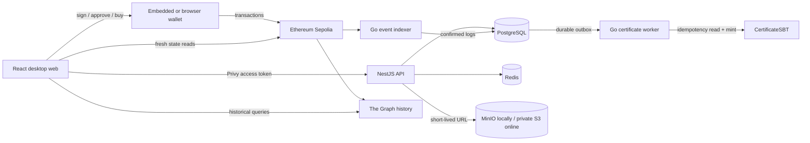
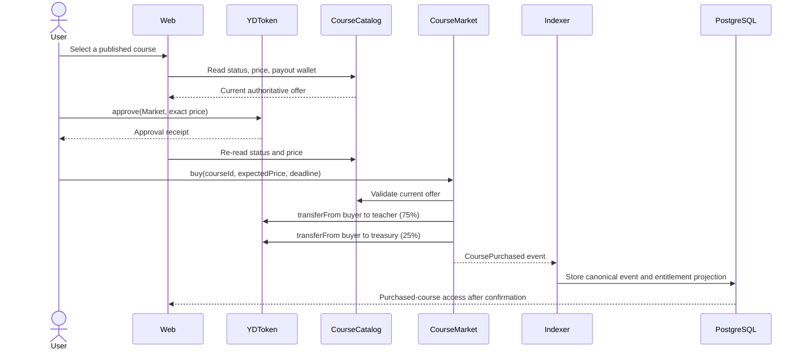
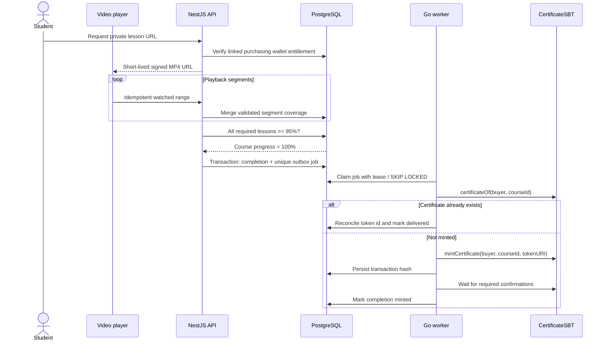
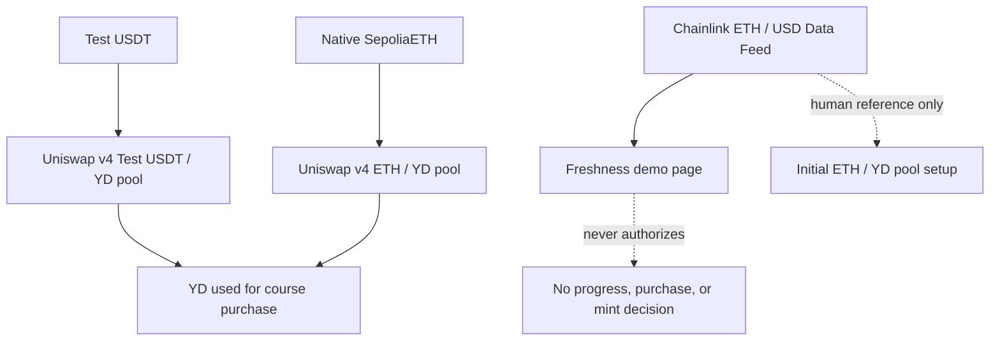
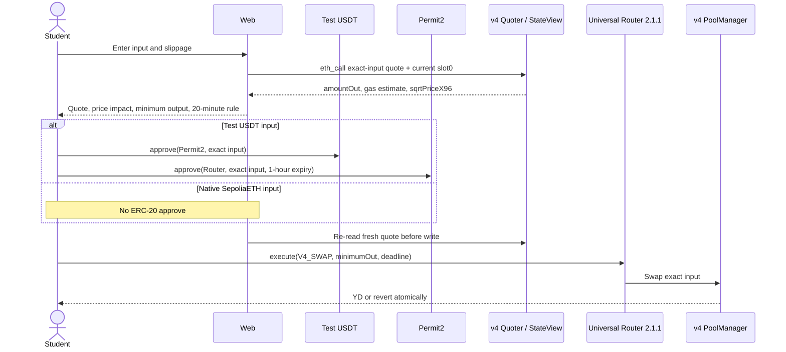

# Core flows

These diagrams separate user intent, application state, and onchain facts. A
successful browser request is never treated as proof of a transaction.

## System boundary

## Course purchase

`expectedPrice` prevents a silent administrator price change between page load
and transaction execution. `deadline` prevents an old signed transaction from
being accepted much later. The contract, not the browser, calculates the 75/25
split.

## Completion and automatic certificate

The progress rule proves submitted playback coverage, not human attention. The
worker does not decide completion; it only executes a durable, retryable mint
job produced by the API transaction.

## Swap and oracle boundaries

The two pools are independent. The initial Test USDT ratio is `1 Test USDT =
10 YD`; a pool needs both assets and liquidity before it can trade. The
Chainlink wrapper is isolated because ETH/USD cannot observe lesson progress or
define YD's market price.

### Student swap transaction

The browser never invents an exchange rate. A missing pool, missing liquidity,
wrong network, missing YD address, failed quote, incomplete authorization, stale
deadline, or violated minimum output stops the write or makes it revert.
